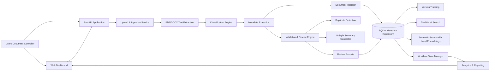

# Week 18 Architecture Documentation

## System Overview

The AI Document Control Assistant is a unified construction document control platform. It combines the Week 15 classification and metadata extraction module, the Week 16 document register and search module, and the Week 17 document review and validation module into one lifecycle platform.

## Architecture Diagram

## Main Modules

| Module | Purpose |
|---|---|
| `app/document_processor.py` | Reads PDF and DOCX files and extracts text. |
| `app/classifier.py` | Classifies documents into construction document types. |
| `app/metadata_extractor.py` | Extracts title, revision, project, contractor, consultant, submission date, and discipline. |
| `app/repository.py` | Stores documents, metadata, embeddings, and versions in SQLite. |
| `app/search_engine.py` | Provides traditional, semantic, and natural language search. |
| `app/review_engine.py` | Validates documents, detects missing information, finds duplicates, and generates summaries. |
| `app/review_repository.py` | Stores review reports. |
| `app/workflow.py` | Manages document lifecycle states and workflow history. |
| `app/analytics.py` | Generates analytics, quality metrics, and performance reports. |
| `app/main.py` | Provides the FastAPI backend and simple dashboard. |

## Workflow States

The platform supports these document lifecycle states:

1. `registered`
2. `under_review`
3. `needs_revision`
4. `approved`
5. `rejected`
6. `archived`

## Storage

The platform uses a local SQLite database named `document_register.db`.

Main tables:

- `documents`
- `document_reviews`
- `workflow_history`

## User Interfaces

- API documentation: `http://127.0.0.1:8000/docs`
- Dashboard: `http://127.0.0.1:8000/dashboard`
